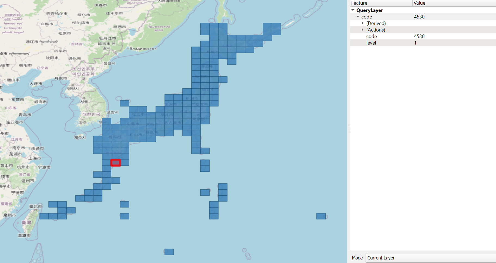
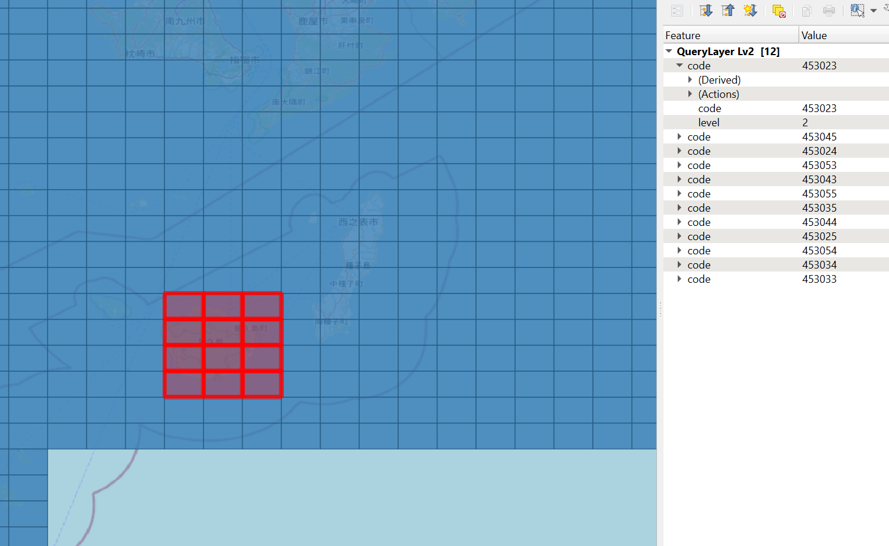

# jismesh-to-sql

このアプリケーションは KotobaMedia の `to-sql` シリーズの一つです。 `jismesh-to-sql` は JIS X 0410 地域メッシュコードの参照テーブルを作る目的に作っています。この参照テーブルを使うことによってメッシュコード単位で保管しているデータとPostGISのgeometry方で保管しているデータを気軽にJOINできるようになります。QGIS の PostgreSQL レイヤーでも使えます。




## 使い方

注意: デフォルトではすべてのメッシュレベルを生成するので、膨大なデータになります。6次メッシュまで必要なければ、必要なメッシュレベルを `-l` オプションで指定してください。また、生成する親メッシュを指定する場合は `-r` で絞ることができます（デフォルトでは日本の陸地すべてを対象としております）。

```
Usage: jismesh-to-sql [OPTIONS] <POSTGRES_URL>

Arguments:
  <POSTGRES_URL>  Postgresデータベースに接続する文字列

Options:
      --skip-metadata              メタデータテーブルの更新・作成をスキップする。
  -l, --levels <LEVELS>            カンマ区切りの整数のリスト。メッシュコードのテーブルを作成する際に、指定したレベルの メッシュコードを作成します。 受付可能な値は <https://docs.rs/jismesh/latest/jismesh/enum.MeshLevel.html> で参照できます 。
  -r, --root-meshes <ROOT_MESHES>  メッシュコードのテーブルを作成する際に、こちらのオプションで指定したメッシュコードの 中の、 `levels` で指定したレベルのメッシュコードを作成します。 デフォルトでは、日本陸地を表すメッシュコードすべてが対象 となります。 詳しくは <https://docs.rs/jismesh/latest/jismesh/codes/constant.JAPAN_LV1.html> を参照してください。
```

指定のデータベースの `jismesh_codes` テーブルに保管されます。スキーマは下記となります。

```sql
-- Table Definition
CREATE TABLE "public"."jismesh_codes" (
    "code" int8 NOT NULL,
    "level" int4 NOT NULL,
    "geom" geometry NOT NULL,
    PRIMARY KEY ("code")
);

-- Indices
CREATE INDEX jismesh_codes_code_idx ON public.jismesh_codes USING btree (code, level);
CREATE INDEX jismesh_codes_geom_idx ON public.jismesh_codes USING gist (geom);
```

## メタデータ

このツールは `datasets` テーブルにメタ情報を追加します。

```jsonc
{
    "desc": "JIS X 0410 地域メッシュコードとgeometryを双方にマッピングするためのテーブル",
    "name": "メッシュコード位置参照",
    "primary_key": "code",
    "columns": [
        {
            "desc": "地域メッシュコード",
            "name": "code",
            "data_type": "bigint",
        },
        {
            "desc": "メッシュ区画 (1次、2次など)",
            "name": "level",
            "data_type": "integer",
            "enum_values": [
                {
                    "desc": "1次 (80km四方)",
                    "value": "1"
                },
                {
                    "desc": "2次 (10km四方)",
                    "value": "2"
                },
                // ...
            ]
        },
        {
            "desc": "地域メッシュを表すポリゴン",
            "name": "geom",
            "data_type": "geometry(polygon, 4326)"
        }
    ],
    "source_url": "https://www.stat.go.jp/data/mesh/pdf/gaiyo1.pdf"
}
```
